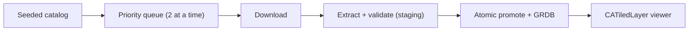

<p align="center">
  
</p>

<h1 align="center">FloorplanViewer</h1>

<p align="center">
  A native iOS DZI floorplan viewer that prepares projects automatically, works offline, and keeps markers in place.
</p>

<p align="center">
  
  
  
  
</p>

## Demo

[](https://youtube.com/shorts/OCCyzWOx-SI?feature=share)

## Highlights

- Automatic download → extract → validate → offline cache, fully hands-off.
- Native `UIScrollView` + `CATiledLayer` rendering—no web view.
- Smooth pan/zoom with persistent, normalized markers.
- Demo tools for offline mode, slow downloads, 404s, and reset.

## Run

Requires Xcode 26, an iOS 17+ simulator or device, and XcodeGen. The verify lanes below additionally use SwiftFormat, SwiftLint, and xcbeautify.

```sh
make generate            # regenerate FloorplanViewer.xcodeproj from project.yml
open FloorplanViewer.xcodeproj
```

Run the `FloorplanViewer` scheme. The catalog is seeded on first launch and prepares itself—no configuration, no login.

Verify:

```sh
make lint                # SwiftFormat --lint + SwiftLint --strict
make test                # Swift Testing suite (simulator)
make build               # zero-warning build (warnings are errors)
```

`make test` / `make build` default to an iPhone 15 Pro / iOS 17.2 simulator; any installed iOS 17+ simulator works—pass yours as `make test DESTINATION='platform=iOS Simulator,name=iPhone 17'`.

## Third-party libraries

| Library | Version | Used for |
|---|---|---|
| [GRDB.swift](https://github.com/groue/GRDB.swift) | 7 | SQLite persistence, forward-only migrations, and `ValueObservation` streams |
| [SWCompression](https://github.com/tsolomko/SWCompression) | 4 | gzip + tar extraction (pure Swift, no transitive dependencies) |

Only these two. Rendering, DZI parsing, networking, and concurrency are all Foundation / UIKit / SwiftUI.

## Architecture

SwiftUI, Swift 6 with **complete** strict concurrency (`MainActor` default isolation, warnings-as-errors). `AppEnvironment` is the composition root: it builds and owns every dependency—there are no singletons—and each collaborator is injected behind a protocol (`PackageDownloading`, `ArchiveExtracting`, `PackageValidating`, `PathMonitoring`, `AppClock`) so tests swap in stubs.

```
App/           launch, recovery, root scene
Features/      ProjectList, Viewer, Settings (SwiftUI + @Observable models)
Services/      DZI parsing, Preparation pipeline, Connectivity
Repositories/  GRDB reads/writes + ValueObservation
Core/          Database, Storage, Concurrency, Clock, Logging, Debug
Models/        pure value types
```

`PackagePreparationCoordinator` is an `actor` and the **sole owner** of package state transitions. Pure math/parsing types (`TilePyramid`, `DZIDescriptor`, `DZIDescriptorParser`) are `nonisolated`, so they run on the `CATiledLayer` background draw path and in `@concurrent` validation without ever touching the main actor.



## Data model (GRDB schema)

A WAL `DatabasePool` with forward-only migrations; the catalog is seeded inside `v1`. Four tables:

- **project** — `id` PK, `name`, `package_url`, `sort_order` (unique).
- **package** — one row per project (PK = `project_id`, FK `ON DELETE CASCADE`). Holds `state_raw`, the archive / extracted / descriptor / tiles relative paths, the six `dzi_*` metadata columns, `download_progress` (`CHECK 0…1`), and retry bookkeeping (`retry_count`, `next_retry_at`, `last_attempt_at`, `last_success_at`, `updated_at`).
- **marker** — `id` PK, `project_id` (FK cascade, indexed), `normalized_x` / `normalized_y` (`CHECK 0…1`), `created_at`.
- **appState** — single row (`id CHECK = 1`) holding `last_selected_project_id`.

The six `dzi_*` columns plus the resolved descriptor/tiles paths form a **readiness set**: written together in `markReady`, cleared together on demotion, and only ever read through the complete-or-absent `ReadyPackage`. The viewer never opens paths from an unverified row.

## Package state model

Durable state (persisted as `state_raw`) is a seven-case machine:

```
notPrepared → queued → downloading → downloaded → extracting → ready
```

with `failed` reachable from any real attempt. Presentation state (`PackageDisplayState`) is **derived, never persisted**—it folds the durable row together with live connectivity and retry timing into what the UI shows (`preparing`, `retrying`, `extracting`, `ready`, `failedWillRetry`, `unavailableOffline`). **Offline is never a failure:** it parks work in `queued` without recording a reason.

## How automatic preparation works

Every project drains through one pipeline (`runSteps`):

1. A `ready` row is re-verified against disk—never blindly trusted; a broken row demotes and re-prepares.
2. Ensure the archive exists (the only network-gated step). Offline → park in `queued`, uncharged.
3. Extract into fresh staging.
4. Validate the extracted tree **in staging**.
5. Promote atomically (`replaceItemAt`), then the single DB write that references the promoted files.

Preparation is **single-flight**: the per-project task handle is registered before the first suspension, so a repeat `prepare` is a no-op (actor reentrancy can't double-start it). Background work runs **two at a time** behind an `AsyncSemaphore`; tapping a project (or opening the viewer) promotes its waiter to `userInitiated`—it jumps the queue **without cancelling in-flight transfers**. So with a large catalog, the plan you open downloads first; equal-priority work stays FIFO.

## Retry & idempotency

- **Files first, then the DB write that references them.** Extraction is validated in staging and promoted atomically—an unvalidated tree is never visible.
- **Cancellation records no outcome:** it resets to the nearest safe checkpoint (`downloaded` if the archive survived, else `queued`) via a cancellation-shielded write, so re-running the pipeline is idempotent.
- **Backoff:** capped exponential with equal jitter (first auto-retry ~1.5–3 s, doubling, capped at 5 min). A per-session cap (6 automatic attempts) stops a permanent 404 from hot-looping, and when capped the UI promises no retry it can't deliver. Launch, selection, connectivity, and manual retry all reset the cap.
- A corrupt archive is dropped so the retry re-downloads; a bad descriptor or missing tiles fails validation *before* anything is promoted.
- Restored connectivity clears `next_retry_at` and re-drains everything; a single coalesced timer wakes the soonest-due failed row.

## How DZI metadata is parsed

The `.dzi` XML descriptor is parsed with Foundation's `XMLParser`—namespace-agnostic, case-insensitive attributes, whitespace-trimmed values. A `DZIDescriptor` is validated at construction (positive dimensions, `0 ≤ overlap < tileSize`, format ∈ {`jpg`, `jpeg`, `png`}), so an invalid descriptor can't exist. The **locator** finds the descriptor and tile directory by a bounded-depth recursive scan rather than hardcoded names—the samples ship `tileset/floorplan.dzi` + `tiles/`, not the canonical `<name>_files/`—and the full-resolution level is discovered from disk. A non-standard `dzi.json` sidecar, if present, is decoded only as a **cross-check** (mismatches are logged); the descriptor and on-disk pyramid stay authoritative.

## How tile rendering works

A `UIScrollView` owns pan/pinch; the content view is a `CATiledLayer` canvas whose coordinate space **is** full-resolution image pixels (1 pt ≡ 1 px), so scroll math, tap points, and marker anchors all share one space. `CATiledLayer` calls `draw(_:)` concurrently on background threads; for each tile it picks the DZI folder level whose pixel density matches the backing store (`LOD × displayScale`), then draws only the tiles intersecting the dirty rect. `TileProvider` loads tiles lazily with `UIImage(contentsOfFile:)`, predecodes each once, and caches into a thread-safe `NSCache` bounded to **48 MB / 120 tiles**—a full-floorplan bitmap never exists, and missing tiles are simply skipped.

## How marker coordinates are stored

Markers are stored in **normalized `0…1` floorplan coordinates** (clamped before insert, DB `CHECK`-constrained)—never screen pixels—so they stay glued to the plan across zoom, rotation, project switching, and relaunch. `ViewportMath` converts screen ↔ image ↔ normalized; a tap resolves to place / select / deselect through the pure `MarkerTapResolver`. Placement is optimistic (the pin appears the same frame) and confirmed a beat later by the GRDB `ValueObservation` stream.

## Known limitations

- **No background `URLSession` or resume (deliberate).** An interrupted download discards its partial and re-fetches from scratch on retry. At ~600 KB per sample that re-download is effectively free, and the transfer path stays simple and corruption-proof.
- Archives are decompressed **in memory**—fine at sample sizes, not for very large plans.
- English-only UI; no UI-automation suite yet.

## What I'd improve with more time

**Background + resumable downloads—the first thing I'd add for large archives.** Today's fail-safe "re-fetch from scratch" is the right trade-off at ~600 KB, especially since tap-to-prioritize already means the plan you open downloads first. But once packages grow to tens or hundreds of MB, an interrupted transfer must *resume*, not restart. That means:

- **HTTP `Range` resume with `ETag` / `If-Range` validation**—which first requires *confirming the server actually supports `Accept-Ranges` and stable ETags*. Without that guarantee, resuming risks stitching together a corrupt archive, so it needs real testing before it can be trusted.
- **A background `URLSession`** so transfers continue while the app is suspended—worth the added complexity only at that scale.
- **Streaming tar.gz extraction** (decode-to-disk instead of whole-archive-in-memory) so genuinely huge plans don't blow the memory budget.

Beyond downloads: content checksums, and accessibility/performance UI automation.
