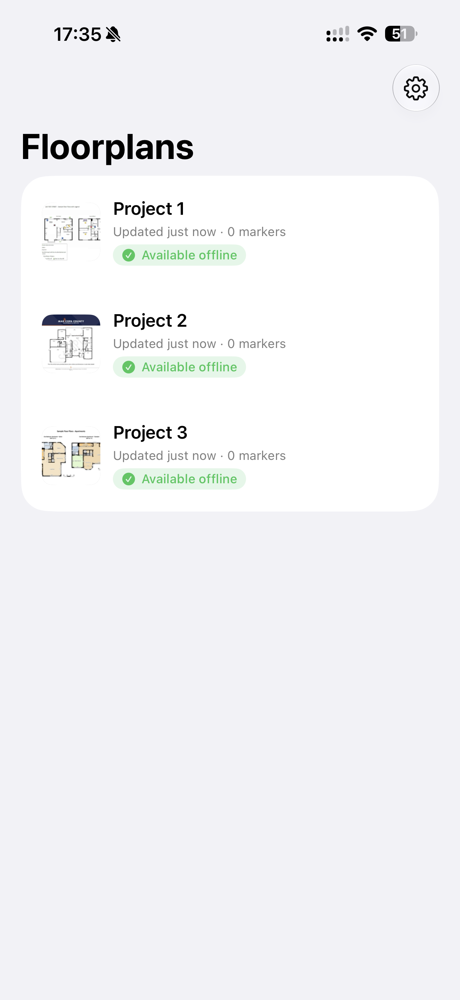
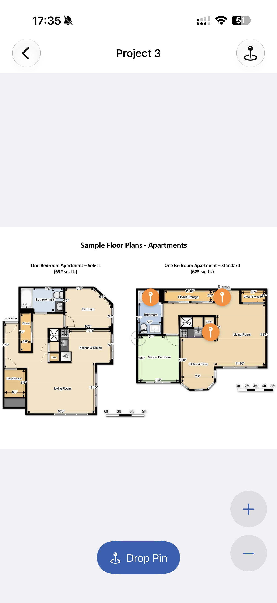
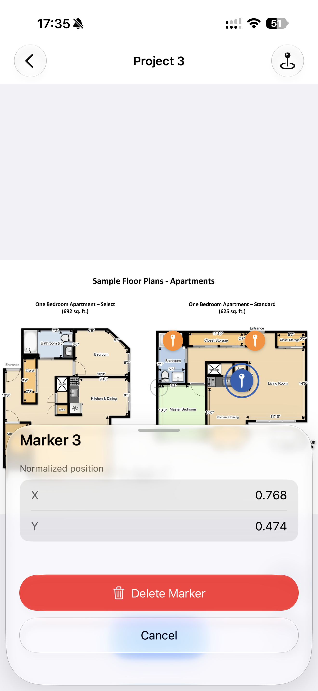
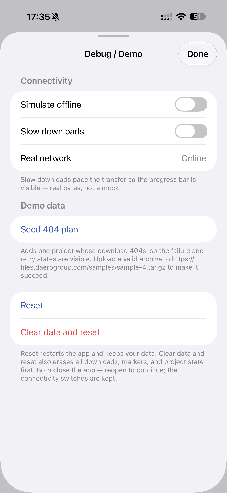
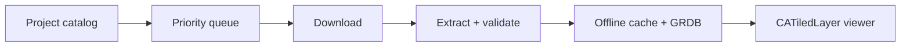

<p align="center">
  
</p>

<h1 align="center">FloorplanViewer</h1>

<p align="center">
  A native iOS DZI floorplan viewer that prepares projects automatically, works offline, and keeps markers in place.
</p>

<p align="center">
  
  
  
  
</p>

## Demo

[](https://youtube.com/shorts/OCCyzWOx-SI?feature=share)

## Highlights

- Automatic download, extraction, validation, and offline caching.
- Native `UIScrollView` + `CATiledLayer` rendering—no web viewer.
- Smooth pan/zoom with persistent normalized markers.
- Demo tools for offline mode, slow downloads, 404s, and reset.

## Run

Requires Xcode 26, iOS 17+, and XcodeGen.

```sh
make generate
open FloorplanViewer.xcodeproj
```

Run the `FloorplanViewer` scheme on an iPhone or iPad simulator.

## How it works



Preparation is single-flight (one pipeline per project) and priority-aware: background projects
prepare two at a time, but tapping a project promotes it to the next free slot ahead of the queue
without cancelling in-flight work. So with a large catalog, the plan you open is the one that
downloads first; equal-priority work stays FIFO.

## Engineering notes

| Area | Implementation |
|---|---|
| Persistence | GRDB stores projects, package state, markers, and selection; ready paths are rechecked on disk. |
| Preparation | `queued → downloading → downloaded → extracting → ready`, atomic staging, idempotent retry, and bounded backoff. Offline is not a failure. |
| DZI | Finds the descriptor and parses dimensions, tile size, overlap, and format, including the supplied rebased pyramids. |
| Rendering | Loads only visible tiles into a thread-safe 48 MB cache. UIKit is limited to the viewer bridge. |
| Markers | Normalized `0...1` coordinates survive zoom, rotation, project switching, and relaunch. |
| Stack | SwiftUI, Swift 6 strict concurrency, GRDB 7, and SWCompression 4. |

## Verify

```sh
make lint
make test
make build
```

## Known limitations

- **No background `URLSession` (deliberate).** An interrupted download discards its partial and
  resets to the last safe checkpoint, so a retry re-fetches from scratch. At ~600 KB per sample
  that re-download is effectively free, and the transfer path stays simple and corruption-proof.
  The first production step would be HTTP `Range` resume—which already survives an app relaunch; a
  background session is only needed to keep downloading while the app is closed, and isn't worth
  the added complexity at this scale.
- Small sample archives are decompressed in memory.
- English-only UI; no UI automation suite yet.

With more time: `Range`-resumable downloads, streaming extraction, checksums, and accessibility/performance automation.
